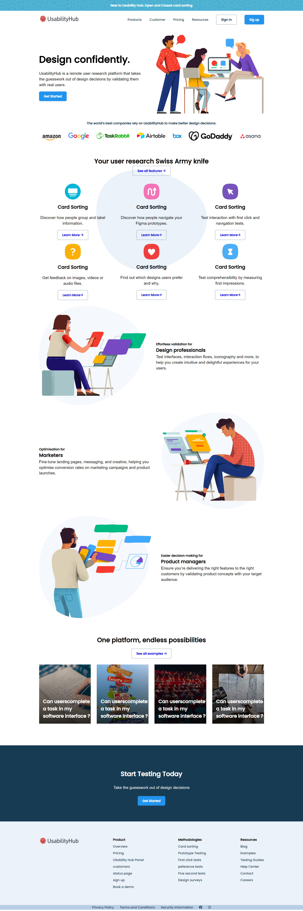

# Landing Pages
Hi, This repository features full-length - website landing pages.

Built with:

 

 

# Project 1:
"Credit Card" landing page.
- ### Output:
  

# Project 2:
"Hoisting" landing page.
- ### Output:
  

  # Project 3:
"Gaming" landing page.
- ### Output:
  

  
  # Project 4:
"Gaming" landing page.
- ### Output:
  

   # Project 5:
"Beats" landing page.
- ### Output:
  

  # Project 6:
"Data Analytics" landing page.
- ### Output:
  

  # Project 7:
"Useability Hub" landing page.
- ### Output:
  

